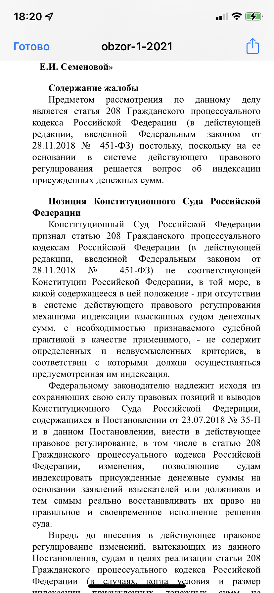

# GXQuickLookView

## Модуль с утилитами для iOS проектов.

# 🔷 Требования

&nbsp;&nbsp;&nbsp;&nbsp;&nbsp;✅ Xcode 12.0  
&nbsp;&nbsp;&nbsp;&nbsp;&nbsp;✅ Swift 5+  
&nbsp;&nbsp;&nbsp;&nbsp;&nbsp;✅ iOS 14

# 🔷 Установка

`GXQuickLookView` доступен через [Swift Package Manager](https://swift.org/package-manager).

Используя Xcode 12 и выше, нужно зайти в  `File -> Swift Packages -> Add Package Dependency` ввести адрес репозитория. 
Выбираем последнюю версию по тегу, ждем синхронизации, вуаля, можно использовать утилитки) 
При обновлении утилит, можно воспользоваться `File -> Swift Packages -> Update to Latest packages versions`

# 🔷 Documentation
## ВАЖНО!!!
Вы должны использовать локальный URL файла, а не удаленный на сервере. Для этого Вам нужно сохранить файл в FileManager.default.urls(for: .documentDirectory, in: .userDomainMask) 

``` swift
struct ContentView: View {
    @State private var showQuickLook: Bool = false
    @State private var previewURL: URL? = *local url from FileManager*
    
    var body: some View {
        Button("Show file in QuickLook") {
            showQuickLook.toggle()
        }
        .padding()
        .fullScreenCover(isPresented: $showQuickLook) {
            GXQuickLookView(url: $previewURL, isPresented: $showQuickLook)
        }
    }
}
```




# 🔷 Contributing

See [CONTRIBUTING.md](CONTRIBUTING.md).

🔷🔷🔷 https://garpix.com 🔷🔷🔷


